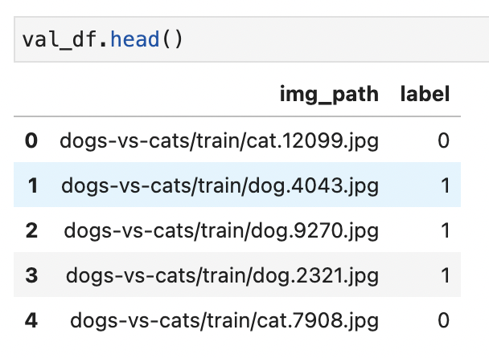

# Image Classification Module

training and testing module for image classification task

## Data Preprocessing

以 dogs-vs-cats dataset 為例，請參考 [preprocessing/dataset_process.ipynb](preprocessing/dataset_process.ipynb)
整理 train.csv 跟 val.csv 兩份資料表單
格式如下

* img_path (string): 相對於照片的根目錄的路徑
  假設我們的資料集根目錄為 data/ 裡面有許多不同種類的資料集，則 img_path 裡面的值就要設 data/ 之後的相對路徑

```
data/ 
 | - cifar10/
 | - coco/
 | - dogs-vs-cats/
      | - train/
      | - test/   
```

* label (int): 類別定義





## Model Training

```bash
python main.py \
        --data-dir data/  \
        --train data/dogs-vs-cats/train.csv  \
        --val data/dogs-vs-cats/val.csv  \
        --arch resnet18 \
        --num-classes 2 \
        --epochs 50 \ 
        --lr 0.001 \
        --batch 32 \
        --checkpoint model_ckpt/  

   
 
```

參數說明:
* --data-dir: 資料集所在的根目錄 
* --train:  訓練資料集 train.csv 所在的路徑
* --val:  驗證資料集 val.csv 所在的路徑
* --test: 測試資料集 test.csv 所在的路徑
* --arch: 模型架構設定 resnet18, resnet34, resnet50, ...etc
* --num-classes: 類別數量設定，如果是貓狗照片分類的任務類別數量就是 2 
* --epochs: 設定訓練多少個 epoch 數量
* --lr: learning rate 設定
* --batch: 設定 batch size 值
* --checkpoint: 模型存放路徑

詳情請參考 [config.py](config.py)
