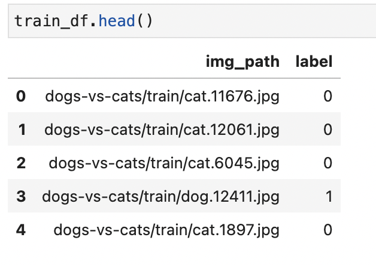
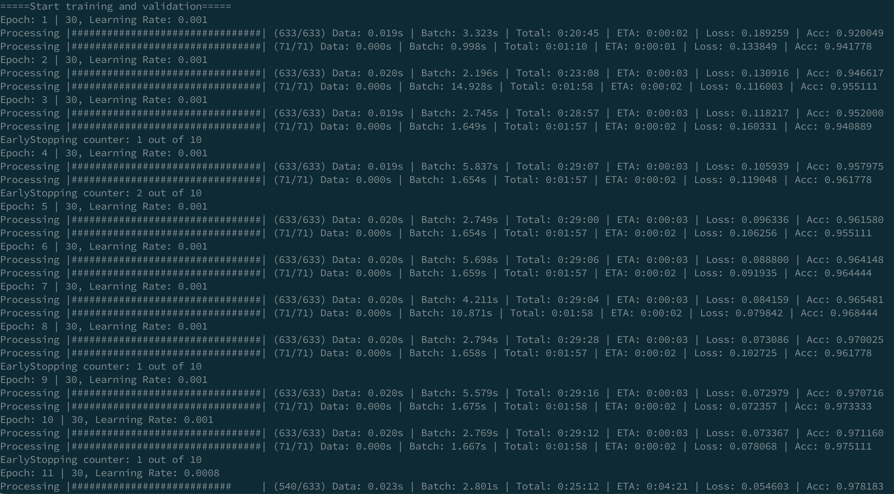

# Image Classification Module

training and testing module for image classification task

## Data Preprocessing

以 dogs-vs-cats dataset 為例，請參考 [preprocessing/dataset_process.ipynb](preprocessing/dataset_process.ipynb)
整理 train.csv, val.csv 以及 test.csv 三份資料表單
格式如下

* img_path (string): 相對於照片的根目錄的路徑
  假設我們的資料集根目錄為 data/ 裡面有許多不同種類的資料集，則 img_path 裡面的值就要設 data/ 之後的相對路徑

```
data/ 
 | - cifar10/
 | - coco/
 | - dogs-vs-cats/
      | - train/
      | - test/   
```

* label (int): 類別定義

例: Training dataset 裡面的內容:



### Data split to Train / Val / Test

請參考 [preprocessing/dataset_process.ipynb](preprocessing/dataset_process.ipynb)


## Model Training

```bash
python main.py \
        --data-dir data/  \
        --train data/dogs-vs-cats/train.csv  \
        --val data/dogs-vs-cats/val.csv  \
        --arch resnet18 \
        --num-classes 2 \
        --epochs 30 \ 
        --lr 0.001 \
        --batch 32 \
        --checkpoint model_ckpt/  \
        --gamma 0.8 --schedule 10 20 \
        --aug --pretrain 
```

參數說明: ( 詳情請參考 [config.py](config.py) 及 [train.sh](train.sh) )

* --data-dir: 資料集所在的根目錄
* --train:  訓練資料集 train.csv 所在的路徑
* --val:  驗證資料集 val.csv 所在的路徑
* --arch: 模型架構設定 resnet18, resnet34, resnet50, ...etc
* --num-classes: 類別數量設定，如果是貓狗照片分類的任務類別數量就是 2
* --epochs: 設定訓練多少個 epoch 數量
* --lr: learning rate 設定
* --batch: 設定 batch size 值
* --checkpoint: 模型存放路徑
* --gamma: learning rate decay ratio 相關設定
* --schedule: 設定在哪些 epoch 時做 learning rate decay
* --aug: 設定打開後，會在訓練階段時，load 訓練資料集時做 image augmentation 詳細內容請見 [dataloader.py](dataloader.py)
* --pretrain: 設定打開後，會 load model imagenet pretrain weight 做 fine-tune 訓練

**training demo**



## Model Inference

```
python inference.py  \
    --data-dir data/  \
    --test-mode \
    --test data/dogs-vs-cats/test.csv  \
    --arch resnet18  \
    -c model_ckpt/  \
    --model-file model_best.pth.tar \
    --num-classes 2  \
    --class-def data/dogs-vs-cats/class_def.txt  
```

參數說明: ( 詳情請參考 [config.py](config.py) 及 [test.sh](test.sh) )

* --data-dir: 資料集所在的根目錄
* --test-mode: 設定打開後進入測試模式，在測試階段必需設定才會對於 dataloader 有相對應的處理，詳細內容請見 [dataloader.py](dataloader.py)
* --test: 測試資料集 test.csv 所在的路徑
* --arch: 模型架構設定 resnet18, resnet34, resnet50, ...etc
* --batch: 設定 batch size 值
* -c: 模型存放的資料夾，預設為 model_ckpt
* --model-file: 模型檔名，預設為 model_best.pth.tar
* --num-classes: 類別數量設定，如果是貓狗照片分類的任務類別數量就是 2
* --class-def: 類別的名稱定義的文字檔路徑，需準備一個 txt 檔案，一行放一個類別名稱，例如貓狗辨識的類別定義如下所示:


### Testing report

模型測試報告的 confusion matrix 與 ROC curve 都會存放在模型檔案存放的 checkpoint 路徑下


<!--  -->

**Classification Report Demo**


**Confusion Matrix Demo**


**ROC Curve demo**


